<h1 align="center">Subodh Ghimire</h1>

<!-- 

  AI/ML &amp; Backend Developer building scalable APIs and machine learning systems

 -->

  
  

  
  
  
  
<!--   </a>
    -->

---
<table align="center" border="0" cellspacing="0" cellpadding="0">
  <tr>
    <td valign="middle" align="center">
      
    </td>
    <td valign="middle" align="center">
      
       
      
    </td>
  </tr>
</table>

<h2 align="center"></h2>

<!--  -->

###

  
  
  
  
  
  
  
  
  
  
  
  
  
  
  
  
  
  
  
  
  
  
  
  
  
  
  
  
  
  
  
  
  
  
  
  
  
  
  
  
  

###

<h2 align="center"></h2>

###

###

  

### 

  

###
